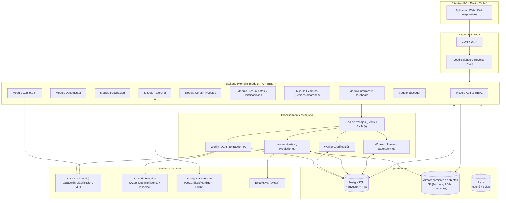
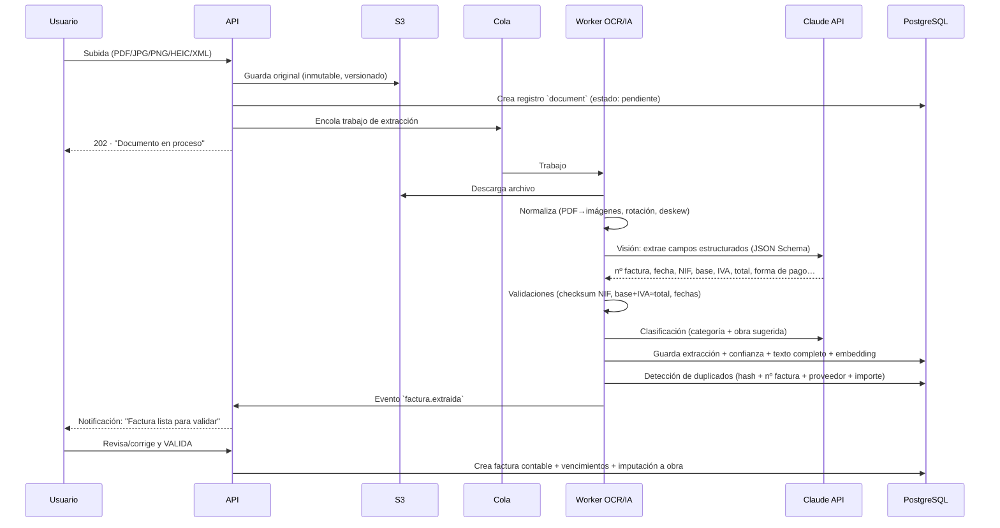

# 01 · Arquitectura del Sistema

> ERP de gestión integral para empresas de construcción: documentación económica, administrativa y documental centralizada en una única plataforma.

## 1. Visión general

El sistema se diseña como un **monolito modular** desplegado en la nube, con un **pipeline asíncrono de OCR/IA** desacoplado mediante colas. Esta decisión prioriza:

- **Velocidad de desarrollo** en las fases iniciales (un solo despliegue, una sola base de datos).
- **Escalabilidad progresiva**: los módulos están delimitados internamente (bounded contexts), de forma que cualquiera puede extraerse como servicio independiente si el volumen lo exige (el primero candidato es el pipeline de OCR/IA, que ya nace como worker separado).
- **Coste operativo bajo** para una PyME de construcción.



## 2. Principios de diseño

| Principio | Aplicación concreta |
|---|---|
| **La obra es el eje** | Todo ingreso, gasto, documento, pedido o certificación se asocia a una obra (o a "gastos generales"). El coste y margen por obra se calculan en tiempo real. |
| **El documento es la fuente de verdad** | Cada apunte económico nace de un documento archivado (factura, albarán, certificación). Nada se teclea dos veces: el OCR/IA extrae, el humano valida. |
| **Validación humana de lo extraído** | La IA propone (datos extraídos, categoría, obra); un usuario confirma. Cada campo lleva un nivel de confianza; por debajo del umbral se exige revisión. |
| **Asíncrono todo lo pesado** | OCR, clasificación, generación de informes, alertas y predicciones corren en workers; la API nunca se bloquea. |
| **Auditable** | Toda operación de escritura queda registrada (quién, qué, cuándo, valor anterior/posterior). |
| **API-first** | El frontend consume la misma API pública que futuras integraciones (asesoría contable, banca, licitaciones). |
| **Multi-empresa preparado** | Todas las tablas llevan `company_id` desde el día 1, aunque el MVP opere con una sola empresa. |

## 3. Capas del backend

```
┌─────────────────────────────────────────────┐
│  API Layer (controladores REST + validación) │
├─────────────────────────────────────────────┤
│  Application Layer (casos de uso, permisos)  │
├─────────────────────────────────────────────┤
│  Domain Layer (entidades, reglas de negocio) │
├─────────────────────────────────────────────┤
│  Infrastructure (ORM, S3, colas, LLM, bancos)│
└─────────────────────────────────────────────┘
```

- **Módulos** = bounded contexts (ver `03-modulos.md`). Cada módulo tiene sus controladores, servicios y repositorios; se comunican entre sí mediante servicios de aplicación o eventos de dominio internos (event emitter), nunca accediendo a tablas ajenas directamente.
- **Eventos de dominio** clave: `documento.subido`, `factura.extraida`, `factura.validada`, `pago.registrado`, `vencimiento.proximo`, `certificacion.aprobada`. Los workers se suscriben a ellos.

## 4. Pipeline documental (OCR + IA)

El corazón del sistema. Flujo al subir cualquier documento:



Decisiones clave:

- **Extracción con LLM de visión (Claude) como motor principal**: los modelos de visión actuales superan al OCR clásico en facturas heterogéneas (fotos de móvil, tickets, facturas escaneadas). Se les pasa la imagen/PDF y un **JSON Schema estricto** con los campos a extraer; devuelven datos + nivel de confianza por campo.
- **OCR clásico como respaldo y para texto completo**: Tesseract (barato) o Azure Document Intelligence (más preciso) generan el texto íntegro que alimenta el buscador full-text.
- **Facturae/XML**: si el archivo subido es factura electrónica (Facturae 3.2, UBL), se parsea directamente sin OCR (obligatorio de cara a la Ley Crea y Crece / VeriFactu en España).
- **Deduplicación en tres niveles**: hash SHA-256 del fichero (duplicado exacto), clave natural (`proveedor + nº factura + importe + fecha`), y similitud de embedding (posible duplicado a revisar).
- **Entrada por email**: cada empresa dispone de un buzón (`facturas@suempresa.erp.app`); los adjuntos entran automáticamente al pipeline. Los proveedores pueden enviar facturas directamente.

## 5. Módulo Copiloto IA

Funciones y cómo se implementan:

| Función | Implementación |
|---|---|
| **Detección de errores en facturas** | Reglas deterministas (base + IVA ≠ total, NIF inválido, fecha futura, IVA fuera de tipos legales 0/4/10/21%) + verificación LLM de coherencia. |
| **Aviso de pagos vencidos** | Worker programado (cron diario) sobre la tabla de vencimientos → notificaciones in-app + email. |
| **Predicción de liquidez** | Proyección de caja a 30/60/90 días: saldo bancario + cobros previstos (por fecha de vencimiento y ratio histórico de morosidad por cliente) − pagos previstos. Alertas cuando el saldo proyectado baja del umbral configurado. |
| **Recomendación de ahorro** | Análisis comparativo de precios por proveedor y material (precio unitario extraído de líneas de factura), desviaciones presupuesto vs. real por capítulo. |
| **Detección de duplicados** | Ver pipeline documental (§4). |
| **Informes automáticos** | Worker mensual genera el informe de cierre (PDF/Excel) y lo envía por email. |
| **Preguntas en lenguaje natural (NLQ)** | Claude con *tool use*: se le exponen herramientas tipadas y seguras (`buscar_facturas`, `gasto_por_categoria`, `cobros_pendientes`, `rentabilidad_obra`…) que ejecutan consultas SQL parametrizadas **con los permisos del usuario**. El LLM nunca escribe SQL libre contra la base de datos. |

## 6. Seguridad

- **Autenticación**: email + contraseña (Argon2) con 2FA TOTP opcional; sesiones con JWT de corta vida + refresh token rotativo httpOnly.
- **Autorización**: RBAC con 4 roles (`admin`, `gerente`, `administracion`, `obra`) + restricción por obra para el rol `obra` (solo ve sus proyectos asignados). Detalle de la matriz de permisos en `03-modulos.md`.
- **Datos**: TLS 1.3 en tránsito; cifrado en reposo (S3 SSE + volúmenes cifrados); los ficheros se sirven mediante URLs firmadas con caducidad, nunca públicos.
- **Aislamiento**: `company_id` en cada consulta (middleware) — con opción de activar Row-Level Security de PostgreSQL al pasar a multi-tenant.
- **Auditoría**: tabla `audit_log` inmutable (append-only) para toda escritura.
- **Cumplimiento**: RGPD (datos en región UE, derecho de supresión, DPA con proveedores), y preparación para **VeriFactu / factura electrónica obligatoria B2B en España**.

## 7. Infraestructura, nube y copias de seguridad

| Aspecto | Fase inicial (MVP → v1) | Escalado (v2+) |
|---|---|---|
| **Hosting** | PaaS (Railway / Render / Fly.io) — contenedores Docker | AWS/GCP (ECS o Kubernetes) con autoescalado |
| **Base de datos** | PostgreSQL gestionado (Neon / RDS) | RDS Multi-AZ + réplicas de lectura |
| **Ficheros** | S3 o Cloudflare R2, versionado activado, región UE | Igual + reglas de ciclo de vida (archivado a frío > 5 años) |
| **Backups** | Automáticos: PITR de PostgreSQL (retención 30 días) + snapshot diario cifrado a segundo proveedor; versionado S3 | Igual + réplica cross-region + simulacros de restauración trimestrales |
| **CI/CD** | GitHub Actions: lint + tests + build + deploy a staging/producción | Igual + entornos efímeros por PR |
| **Observabilidad** | Sentry (errores) + logs estructurados + uptime monitor | + OpenTelemetry, métricas de negocio (facturas/día, latencia OCR) |

**Acceso multiplataforma**: la aplicación es una **PWA responsive** (instalable en móvil/tablet, con subida de fotos desde la cámara para tickets y albaranes a pie de obra). Si más adelante se necesita offline avanzado, se envuelve con Capacitor para tiendas de aplicaciones sin reescribir código.
