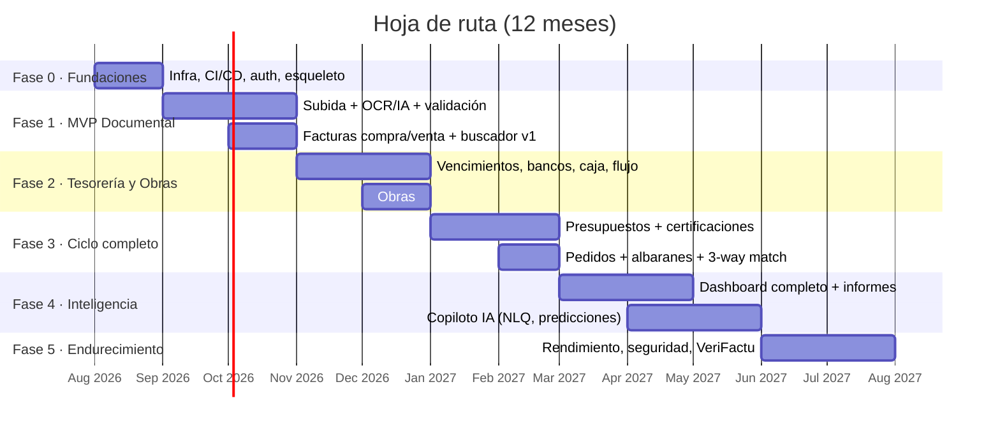

# 06 · Hoja de Ruta

Plan de 12 meses en 5 fases, orientado a **entregar valor usable desde el mes 3** (el archivo documental con OCR ya ahorra horas de administración aunque el resto no exista). Equipo de referencia: 2 desarrolladores full-stack + 1 perfil producto/QA a tiempo parcial; las duraciones escalan proporcionalmente con otro tamaño de equipo.

## Fase 0 · Fundaciones (mes 1)

**Objetivo**: esqueleto profesional sobre el que todo lo demás se apoya.

- Monorepo, Docker de desarrollo, CI/CD (lint, tests, deploy a staging).
- Esquema base de datos inicial + migraciones + seeds (categorías, roles).
- Autenticación (JWT + refresh), RBAC de 4 roles, gestión de usuarios.
- Layout de la aplicación (navegación, tema, responsive) con shadcn/ui.
- Entidades maestras: empresa, contactos (proveedores/clientes), obras.
- Sentry, logs, backups automáticos configurados **desde el primer día**.

**Criterio de salida**: un usuario puede registrarse, crear obras y contactos desde móvil y PC; deploy automático funcionando.

## Fase 1 · MVP documental y facturas (meses 2-4) — primer valor real

- Subida multi-archivo (web + cámara móvil) a S3, listado y visor de documentos.
- Pipeline OCR/IA: extracción de los 7 campos clave + clasificación en las 8 categorías + sugerencia de obra.
- Bandeja de validación (documento + campos editables + confianza + avisos).
- Detección de duplicados (hash + clave natural) y validaciones (NIF, cuadre base+IVA=total, tipos de IVA).
- CRUD de facturas de compra y venta con líneas, series de venta, PDF de factura emitida.
- Buscador v1: full-text (tsvector + trgm) sobre documentos y facturas.
- Export básico a Excel del listado de facturas.

**Criterio de salida**: la empresa deja de archivar en carpetas: toda factura entra por el sistema, se lee sola y se encuentra en segundos. *Este es el momento de empezar a usarlo en producción con datos reales.*

## Fase 2 · Tesorería y control por obra (meses 4-6)

- Vencimientos automáticos por forma de pago; cobros/pagos pendientes con aging.
- Cuentas bancarias y caja; importación de extractos (CSV/Norma 43); conciliación asistida.
- Flujo de caja: saldo real + proyección 30/60/90 días.
- Panel económico por obra: coste real por categoría, facturado, cobrado, margen en vivo.
- Alertas automáticas: pagos/cobros vencidos (email + in-app).
- Dashboard v1: facturación, gastos, beneficio, IVA, pendientes.

**Criterio de salida**: gerencia sabe cada mañana cuánto hay, cuánto se debe, cuánto deben y qué margen lleva cada obra.

## Fase 3 · Ciclo de construcción completo (meses 6-8)

- Presupuestos: capítulos/partidas, versionado, importación **BC3** y Excel.
- Certificaciones a origen + retención de garantía + factura de venta automática.
- Comparativo presupuesto vs. coste real por capítulo, con alertas de desviación.
- Pedidos a proveedor (también desde móvil) y albaranes por foto.
- Cuadre pedido ↔ albarán ↔ factura (3-way match) con bloqueo de facturas descuadradas.
- Integración bancaria PSD2 (sincronización automática de movimientos).

**Criterio de salida**: el ciclo completo oferta→obra→certificación→cobro vive en el sistema; ninguna factura descuadrada se paga sin revisión.

## Fase 4 · Inteligencia y reporting (meses 8-11)

- Dashboard completo (todos los widgets, filtros por periodo/obra, comparativas interanuales).
- Informes automáticos exportables (Excel/PDF): cierre mensual, libro de IVA, económico por obra, aging; envío programado.
- Copiloto IA con NLQ (tool use sobre consultas tipadas con permisos).
- Predicción de liquidez con histórico de comportamiento de pago por cliente.
- Recomendaciones de ahorro (comparativa de precios por proveedor/material).
- Buscador v2: semántico (pgvector) + fusión de resultados.
- Informe mensual redactado por IA para gerencia.

**Criterio de salida**: cualquier pregunta económica de la empresa se responde en < 10 segundos, escrita en lenguaje natural.

## Fase 5 · Endurecimiento y escala (meses 11-12)

- Auditoría de seguridad externa (pentest) + revisión RGPD.
- Rendimiento: particionado, índices, presupuesto de carga < 2 s en 4G.
- Cumplimiento **VeriFactu / factura electrónica B2B** (calendario legal español).
- Simulacros de restauración de backup; runbooks de operación.
- Pulido UX con feedback de los usuarios reales de las fases 1-4.
- Preparación multi-empresa (activar RLS) si se quiere comercializar a terceros.

## Principios de ejecución

1. **Producción temprana**: usuarios reales desde el fin de la Fase 1; cada fase se valida con el uso diario, no con demos.
2. **Datos reales desde el principio**: migrar el histórico de facturas del último año en Fase 1 (el propio pipeline OCR sirve para la migración).
3. **Calidad de extracción medida**: dashboard interno de precisión del OCR/IA por campo; objetivo ≥ 97% en número, fecha, total; cada corrección manual del usuario se registra como dato de evaluación.
4. **Deuda controlada**: tests de integración en los circuitos de dinero (facturas, vencimientos, pagos, certificaciones) como mínimo innegociable.
5. **Una métrica por fase**: F1 = % de facturas que entran sin teclear · F2 = días de retraso medio detectado en cobros · F3 = € recuperados por descuadres detectados · F4 = preguntas NLQ respondidas correctamente.

## Riesgos principales y mitigación

| Riesgo | Mitigación |
|---|---|
| Precisión OCR insuficiente en facturas "difíciles" (fotos malas, tickets) | Confianza por campo + validación humana; guía de captura en el móvil; reintento con modelo superior si confianza baja. |
| Adopción por el personal de obra | La app móvil se limita a 2 acciones (foto de albarán, pedido rápido); formación de 1 hora; valor inmediato visible. |
| Cambios normativos (VeriFactu, e-factura) | Módulo de facturación de venta aislado tras una interfaz; seguimiento del calendario normativo en Fase 5. |
| Dependencia del proveedor LLM | Capa `packages/ai` abstrae el proveedor; prompts y schemas versionados; posibilidad de cambiar de modelo sin tocar el dominio. |
| Alcance creciente ("ya que estamos…") | Este documento es el contrato de alcance; lo que no esté aquí va a una lista v2 priorizada trimestralmente. |
