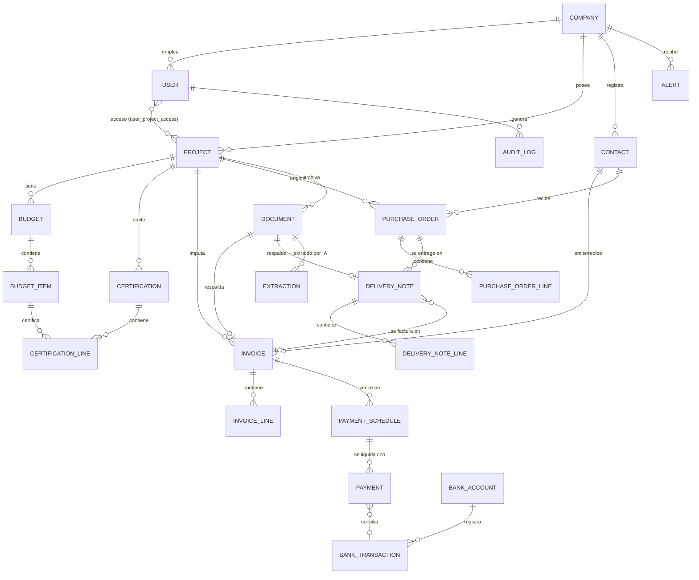

# 02 · Diseño de la Base de Datos

Motor: **PostgreSQL 16+** con extensiones `pg_trgm` (búsqueda difusa), `unaccent` (búsqueda sin tildes) y `pgvector` (búsqueda semántica). Todas las tablas incluyen `company_id`, `created_at`, `updated_at` y borrado lógico (`deleted_at`) donde aplica; se omiten abajo por brevedad.

## 1. Diagrama entidad-relación (núcleo)



## 2. Tablas principales

### 2.1 Identidad y acceso

```sql
CREATE TYPE user_role AS ENUM ('admin', 'gerente', 'administracion', 'obra');

CREATE TABLE companies (
    id          uuid PRIMARY KEY DEFAULT gen_random_uuid(),
    name        text NOT NULL,
    tax_id      text NOT NULL,              -- CIF/NIF
    settings    jsonb NOT NULL DEFAULT '{}' -- umbrales de alertas, series de facturación…
);

CREATE TABLE users (
    id            uuid PRIMARY KEY DEFAULT gen_random_uuid(),
    company_id    uuid NOT NULL REFERENCES companies(id),
    email         citext NOT NULL UNIQUE,
    password_hash text NOT NULL,            -- Argon2id
    full_name     text NOT NULL,
    role          user_role NOT NULL,
    totp_secret   text,                     -- 2FA opcional
    is_active     boolean NOT NULL DEFAULT true
);

-- El rol 'obra' solo accede a los proyectos que se le asignen
CREATE TABLE user_project_access (
    user_id    uuid REFERENCES users(id),
    project_id uuid REFERENCES projects(id),
    PRIMARY KEY (user_id, project_id)
);
```

### 2.2 Terceros y obras

```sql
CREATE TABLE contacts (                      -- proveedores y clientes unificados
    id           uuid PRIMARY KEY DEFAULT gen_random_uuid(),
    company_id   uuid NOT NULL REFERENCES companies(id),
    kind         text NOT NULL CHECK (kind IN ('proveedor','cliente','ambos')),
    legal_name   text NOT NULL,
    trade_name   text,
    tax_id       text,                       -- NIF/CIF (validado con checksum)
    address      jsonb,
    iban         text,
    email        text,
    phone        text,
    payment_terms_days int DEFAULT 30,       -- condición de pago habitual
    default_category_id uuid REFERENCES categories(id), -- p.ej. este proveedor casi siempre es "Materiales"
    UNIQUE (company_id, tax_id)
);

CREATE TYPE project_status AS ENUM ('oferta','adjudicada','en_curso','pausada','finalizada','garantia','cerrada');

CREATE TABLE projects (                      -- obras
    id            uuid PRIMARY KEY DEFAULT gen_random_uuid(),
    company_id    uuid NOT NULL REFERENCES companies(id),
    code          text NOT NULL,             -- OBR-2026-014
    name          text NOT NULL,
    client_id     uuid REFERENCES contacts(id),
    status        project_status NOT NULL DEFAULT 'en_curso',
    address       jsonb,
    start_date    date,
    expected_end  date,
    contract_amount numeric(14,2),           -- importe de adjudicación (sin IVA)
    retention_pct numeric(5,2) DEFAULT 5.0,  -- retención de garantía habitual
    notes         text,
    UNIQUE (company_id, code)
);
```

### 2.3 Categorías de gasto

```sql
CREATE TABLE categories (
    id         uuid PRIMARY KEY DEFAULT gen_random_uuid(),
    company_id uuid NOT NULL REFERENCES companies(id),
    name       text NOT NULL,
    slug       text NOT NULL,   -- materiales | mano_de_obra | maquinaria | subcontratas |
                                -- transporte | herramientas | gastos_generales | otros
    parent_id  uuid REFERENCES categories(id),  -- permite subcategorías (p.ej. Materiales > Hormigón)
    is_system  boolean NOT NULL DEFAULT false,  -- las 8 de serie no se borran
    UNIQUE (company_id, slug)
);
```

Se cargan de serie las 8 categorías requeridas (`Materiales`, `Mano de obra`, `Maquinaria`, `Subcontratas`, `Transporte`, `Herramientas`, `Gastos generales`, `Otros`) y se permite crear subcategorías.

### 2.4 Documental y extracción IA

```sql
CREATE TYPE doc_status AS ENUM ('subido','procesando','extraido','validado','rechazado','error');
CREATE TYPE doc_type   AS ENUM ('factura_compra','factura_venta','albaran','presupuesto',
                                'certificacion','pedido','contrato','ticket','otro');

CREATE TABLE documents (
    id            uuid PRIMARY KEY DEFAULT gen_random_uuid(),
    company_id    uuid NOT NULL REFERENCES companies(id),
    project_id    uuid REFERENCES projects(id),
    doc_type      doc_type,
    status        doc_status NOT NULL DEFAULT 'subido',
    storage_key   text NOT NULL,            -- ruta S3 del original (inmutable)
    file_name     text NOT NULL,
    mime_type     text NOT NULL,
    file_sha256   bytea NOT NULL,           -- dedupe exacto
    uploaded_by   uuid REFERENCES users(id),
    source        text NOT NULL DEFAULT 'web', -- web | email | movil | api
    full_text     text,                     -- texto OCR completo
    fts           tsvector GENERATED ALWAYS AS
                  (to_tsvector('spanish', coalesce(full_text,'') || ' ' || file_name)) STORED,
    embedding     vector(1024)              -- búsqueda semántica
);
CREATE INDEX documents_fts_idx ON documents USING gin(fts);
CREATE INDEX documents_trgm_idx ON documents USING gin (full_text gin_trgm_ops);
CREATE UNIQUE INDEX documents_dedupe_idx ON documents (company_id, file_sha256)
    WHERE deleted_at IS NULL;

CREATE TABLE extractions (                   -- resultado bruto de la IA, versionable
    id           uuid PRIMARY KEY DEFAULT gen_random_uuid(),
    document_id  uuid NOT NULL REFERENCES documents(id),
    model        text NOT NULL,              -- p.ej. claude-sonnet-5
    payload      jsonb NOT NULL,             -- campos extraídos
    confidence   jsonb NOT NULL,             -- confianza 0-1 por campo
    warnings     jsonb NOT NULL DEFAULT '[]',-- errores detectados (cuadre, NIF, duplicado…)
    created_at   timestamptz NOT NULL DEFAULT now()
);
```

### 2.5 Facturas

```sql
CREATE TYPE invoice_direction AS ENUM ('compra','venta');
CREATE TYPE invoice_status AS ENUM ('borrador','pendiente_validacion','validada',
                                    'parcialmente_pagada','pagada','vencida','anulada');

CREATE TABLE invoices (
    id             uuid PRIMARY KEY DEFAULT gen_random_uuid(),
    company_id     uuid NOT NULL REFERENCES companies(id),
    direction      invoice_direction NOT NULL,
    status         invoice_status NOT NULL DEFAULT 'pendiente_validacion',
    document_id    uuid REFERENCES documents(id),      -- PDF/imagen de respaldo
    contact_id     uuid NOT NULL REFERENCES contacts(id),
    project_id     uuid REFERENCES projects(id),       -- NULL ⇒ gastos generales de empresa
    invoice_number text NOT NULL,
    issue_date     date NOT NULL,
    operation_date date,
    tax_base       numeric(14,2) NOT NULL,             -- base imponible
    vat_rate       numeric(5,2),                       -- tipo principal (el detalle va por línea)
    vat_amount     numeric(14,2) NOT NULL,             -- cuota de IVA
    irpf_amount    numeric(14,2) NOT NULL DEFAULT 0,   -- retención IRPF si aplica
    total          numeric(14,2) NOT NULL,
    payment_method text,                               -- transferencia | confirming | pagaré | efectivo…
    category_id    uuid REFERENCES categories(id),     -- para compras
    is_reverse_charge boolean NOT NULL DEFAULT false,  -- inversión del sujeto pasivo (habitual en construcción)
    validated_by   uuid REFERENCES users(id),
    validated_at   timestamptz,
    notes          text,
    -- una misma factura de un proveedor no puede duplicarse
    UNIQUE (company_id, direction, contact_id, invoice_number)
);
CREATE INDEX invoices_project_idx ON invoices(project_id);
CREATE INDEX invoices_date_idx ON invoices(issue_date);

CREATE TABLE invoice_lines (
    id          uuid PRIMARY KEY DEFAULT gen_random_uuid(),
    invoice_id  uuid NOT NULL REFERENCES invoices(id) ON DELETE CASCADE,
    description text NOT NULL,
    quantity    numeric(14,3) DEFAULT 1,
    unit        text,                        -- m2, m3, h, ud, kg…
    unit_price  numeric(14,4),
    tax_base    numeric(14,2) NOT NULL,
    vat_rate    numeric(5,2) NOT NULL,       -- 0 / 4 / 10 / 21
    vat_amount  numeric(14,2) NOT NULL,
    category_id uuid REFERENCES categories(id),  -- una factura puede repartirse en varias categorías
    project_id  uuid REFERENCES projects(id),    -- …y en varias obras
    budget_item_id uuid REFERENCES budget_items(id) -- imputación a partida presupuestaria
);
```

> **Regla de integridad**: `tax_base + vat_amount − irpf_amount = total` se valida en aplicación y con un `CHECK` con tolerancia de ±0,01 € por redondeos.

### 2.6 Vencimientos, pagos y tesorería

```sql
CREATE TYPE schedule_status AS ENUM ('pendiente','parcial','liquidado','vencido','impagado');

CREATE TABLE payment_schedules (             -- vencimientos (cobros y pagos pendientes)
    id          uuid PRIMARY KEY DEFAULT gen_random_uuid(),
    company_id  uuid NOT NULL REFERENCES companies(id),
    invoice_id  uuid NOT NULL REFERENCES invoices(id),
    due_date    date NOT NULL,
    amount      numeric(14,2) NOT NULL,
    status      schedule_status NOT NULL DEFAULT 'pendiente',
    method      text                          -- forma de pago prevista
);
CREATE INDEX schedules_due_idx ON payment_schedules(status, due_date);

CREATE TABLE bank_accounts (
    id          uuid PRIMARY KEY DEFAULT gen_random_uuid(),
    company_id  uuid NOT NULL REFERENCES companies(id),
    name        text NOT NULL,               -- "BBVA principal", "CAJA" (la caja es una cuenta más)
    kind        text NOT NULL CHECK (kind IN ('banco','caja')),
    iban        text,
    opening_balance numeric(14,2) NOT NULL DEFAULT 0,
    provider_link jsonb                      -- credenciales/ids del agregador PSD2
);

CREATE TABLE bank_transactions (             -- extracto (importado o vía agregador)
    id          uuid PRIMARY KEY DEFAULT gen_random_uuid(),
    account_id  uuid NOT NULL REFERENCES bank_accounts(id),
    value_date  date NOT NULL,
    amount      numeric(14,2) NOT NULL,      -- + entrada / − salida
    description text,
    external_ref text,                       -- id del banco (evita reimportar)
    reconciled  boolean NOT NULL DEFAULT false,
    UNIQUE (account_id, external_ref)
);

CREATE TABLE payments (                      -- liquidaciones reales de vencimientos
    id           uuid PRIMARY KEY DEFAULT gen_random_uuid(),
    company_id   uuid NOT NULL REFERENCES companies(id),
    schedule_id  uuid NOT NULL REFERENCES payment_schedules(id),
    account_id   uuid REFERENCES bank_accounts(id),
    transaction_id uuid REFERENCES bank_transactions(id),  -- conciliación bancaria
    paid_on      date NOT NULL,
    amount       numeric(14,2) NOT NULL,
    registered_by uuid REFERENCES users(id)
);
```

### 2.7 Presupuestos y certificaciones

```sql
CREATE TYPE budget_status AS ENUM ('borrador','enviado','aprobado','rechazado','revisado');

CREATE TABLE budgets (                       -- presupuestos de obra (estructura de capítulos/partidas)
    id          uuid PRIMARY KEY DEFAULT gen_random_uuid(),
    company_id  uuid NOT NULL REFERENCES companies(id),
    project_id  uuid NOT NULL REFERENCES projects(id),
    version     int NOT NULL DEFAULT 1,
    status      budget_status NOT NULL DEFAULT 'borrador',
    total_cost  numeric(14,2),               -- coste previsto
    total_sale  numeric(14,2),               -- venta prevista (con margen)
    UNIQUE (project_id, version)
);

CREATE TABLE budget_items (                  -- capítulos y partidas (árbol)
    id          uuid PRIMARY KEY DEFAULT gen_random_uuid(),
    budget_id   uuid NOT NULL REFERENCES budgets(id) ON DELETE CASCADE,
    parent_id   uuid REFERENCES budget_items(id),
    code        text,                        -- 01.02.03 (compatible BC3/FIEBDC)
    description text NOT NULL,
    unit        text,
    quantity    numeric(14,3),
    unit_cost   numeric(14,4),               -- coste unitario previsto
    unit_price  numeric(14,4),               -- precio de venta unitario
    category_id uuid REFERENCES categories(id),
    sort_order  int
);

CREATE TABLE certifications (                -- certificaciones mensuales de obra
    id           uuid PRIMARY KEY DEFAULT gen_random_uuid(),
    company_id   uuid NOT NULL REFERENCES companies(id),
    project_id   uuid NOT NULL REFERENCES projects(id),
    number       int NOT NULL,               -- certificación nº N
    period       daterange NOT NULL,
    status       text NOT NULL DEFAULT 'borrador', -- borrador|presentada|aprobada|facturada
    retention_amount numeric(14,2) DEFAULT 0,
    invoice_id   uuid REFERENCES invoices(id),     -- factura de venta generada
    UNIQUE (project_id, number)
);

CREATE TABLE certification_lines (           -- avance por partida (% o cantidad origen)
    id             uuid PRIMARY KEY DEFAULT gen_random_uuid(),
    certification_id uuid NOT NULL REFERENCES certifications(id) ON DELETE CASCADE,
    budget_item_id uuid NOT NULL REFERENCES budget_items(id),
    qty_period     numeric(14,3) NOT NULL,   -- cantidad ejecutada en el periodo
    qty_to_origin  numeric(14,3) NOT NULL,   -- cantidad a origen
    amount_period  numeric(14,2) NOT NULL
);
```

### 2.8 Pedidos y albaranes

```sql
CREATE TABLE purchase_orders (               -- pedidos a proveedor
    id          uuid PRIMARY KEY DEFAULT gen_random_uuid(),
    company_id  uuid NOT NULL REFERENCES companies(id),
    project_id  uuid REFERENCES projects(id),
    supplier_id uuid NOT NULL REFERENCES contacts(id),
    number      text NOT NULL,               -- PED-2026-0231
    status      text NOT NULL DEFAULT 'borrador', -- borrador|enviado|confirmado|recibido_parcial|recibido|facturado|cancelado
    order_date  date NOT NULL,
    expected_delivery date,
    total_estimate numeric(14,2),
    UNIQUE (company_id, number)
);

CREATE TABLE purchase_order_lines (
    id          uuid PRIMARY KEY DEFAULT gen_random_uuid(),
    order_id    uuid NOT NULL REFERENCES purchase_orders(id) ON DELETE CASCADE,
    description text NOT NULL,
    quantity    numeric(14,3) NOT NULL,
    unit        text,
    unit_price  numeric(14,4),
    category_id uuid REFERENCES categories(id)
);

CREATE TABLE delivery_notes (                -- albaranes de entrega
    id          uuid PRIMARY KEY DEFAULT gen_random_uuid(),
    company_id  uuid NOT NULL REFERENCES companies(id),
    order_id    uuid REFERENCES purchase_orders(id),
    supplier_id uuid NOT NULL REFERENCES contacts(id),
    project_id  uuid REFERENCES projects(id),
    document_id uuid REFERENCES documents(id),   -- foto/PDF del albarán
    number      text,
    delivery_date date NOT NULL,
    invoice_id  uuid REFERENCES invoices(id),    -- cuadre albarán↔factura (3-way match)
    signed_by   text                             -- quién recepcionó en obra
);

CREATE TABLE delivery_note_lines (
    id          uuid PRIMARY KEY DEFAULT gen_random_uuid(),
    note_id     uuid NOT NULL REFERENCES delivery_notes(id) ON DELETE CASCADE,
    order_line_id uuid REFERENCES purchase_order_lines(id),
    description text NOT NULL,
    quantity    numeric(14,3) NOT NULL
);
```

### 2.9 Alertas, auditoría e IA

```sql
CREATE TABLE alerts (
    id          uuid PRIMARY KEY DEFAULT gen_random_uuid(),
    company_id  uuid NOT NULL REFERENCES companies(id),
    kind        text NOT NULL,   -- pago_vencido | cobro_vencido | liquidez | duplicado |
                                 -- error_factura | desviacion_presupuesto | recomendacion
    severity    text NOT NULL DEFAULT 'info',  -- info | warning | critical
    title       text NOT NULL,
    body        text,
    entity_type text,            -- invoice | project | schedule…
    entity_id   uuid,
    read_at     timestamptz,
    resolved_at timestamptz
);

CREATE TABLE audit_log (         -- append-only
    id          bigserial PRIMARY KEY,
    company_id  uuid NOT NULL,
    user_id     uuid,
    action      text NOT NULL,   -- create | update | delete | validate | export | login…
    entity_type text NOT NULL,
    entity_id   uuid,
    before      jsonb,
    after       jsonb,
    ip          inet,
    at          timestamptz NOT NULL DEFAULT now()
);

CREATE TABLE ai_conversations (  -- historial del copiloto NLQ
    id          uuid PRIMARY KEY DEFAULT gen_random_uuid(),
    company_id  uuid NOT NULL,
    user_id     uuid NOT NULL REFERENCES users(id),
    messages    jsonb NOT NULL DEFAULT '[]',
    created_at  timestamptz NOT NULL DEFAULT now()
);
```

## 3. Vistas materializadas para el dashboard

Los KPIs del panel no se calculan al vuelo sobre las tablas transaccionales; se sirven desde vistas materializadas refrescadas por evento (al validar factura/pago) o por cron cada pocos minutos:

| Vista | Contenido |
|---|---|
| `mv_monthly_summary` | Por mes: facturación (ventas), gastos (compras) por categoría, beneficio, IVA repercutido y soportado. |
| `mv_project_economics` | Por obra: contratado, presupuestado (coste), certificado a origen, facturado, cobrado, coste real por categoría, margen % y €, desviación presupuesto vs. real. |
| `mv_treasury_position` | Saldo por cuenta/caja + curva de flujo de caja proyectado a 90 días (vencimientos ± histórico de cumplimiento). |
| `mv_aging` | Antigüedad de saldos: cobros y pagos pendientes por tramos (no vencido, 0-30, 30-60, 60-90, +90). |

## 4. Estrategia del buscador

Tres niveles combinados en una sola caja de búsqueda:

1. **Estructurado**: si la consulta parece un importe (`1.240,50`), fecha (`03/2026`) o NIF, se buscan coincidencias exactas/rango en columnas tipadas.
2. **Full-text + fuzzy**: `tsvector` en español + `pg_trgm` con `unaccent` sobre el texto OCR completo, nombres de proveedor/cliente, números de factura y nombres de archivo (tolera errores de tecleo y de OCR).
3. **Semántico**: embedding de la consulta contra `documents.embedding` (pgvector, índice HNSW) para consultas conceptuales ("factura del alquiler de la grúa de marzo").

Los resultados se fusionan con *reciprocal rank fusion* y se filtran siempre por permisos del usuario (rol + obras asignadas).

## 5. Retención y particionado

- Facturas y documentos: retención mínima legal (6 años mercantil / 4 años fiscal en España); nunca se borra físicamente dentro del plazo, solo borrado lógico.
- `audit_log` y `bank_transactions` se particionan por año cuando el volumen lo justifique.
- Los originales en S3 usan versionado + bloqueo de borrado (Object Lock en modo governance) para integridad probatoria.
