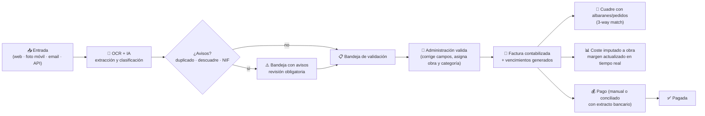
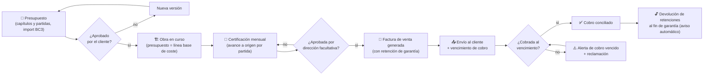
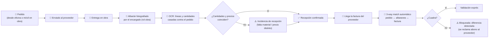
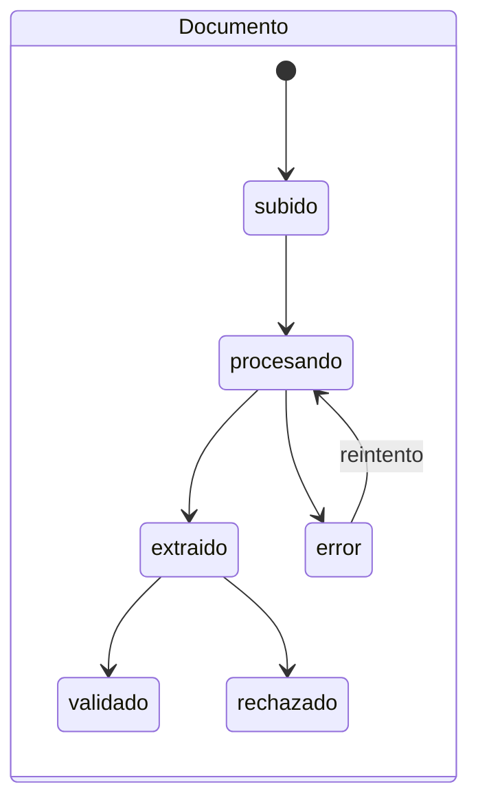
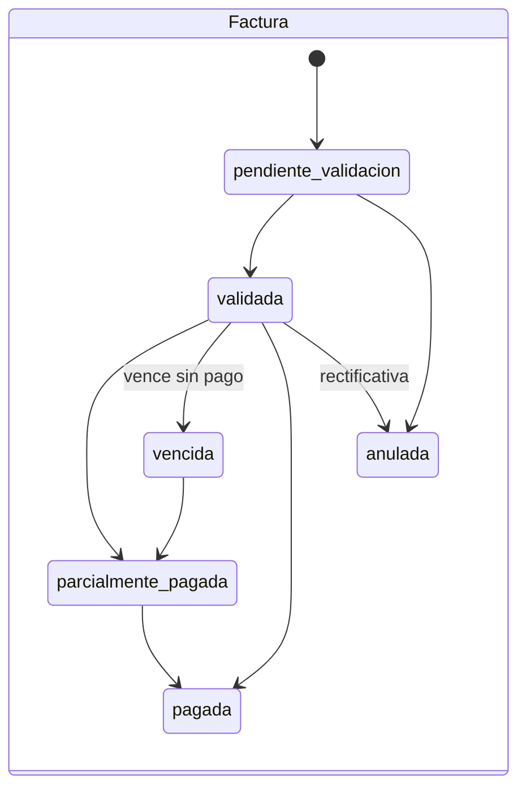

# 04 · Flujos de Trabajo

Los cuatro circuitos operativos que cubren el día a día de una constructora, más los procesos automáticos de fondo.

## F1 · Circuito de gasto (factura de compra)

Reglas:
- Un documento nunca se convierte en apunte económico sin validación humana (salvo que el usuario active auto-validación para extracciones con confianza > 98% y sin avisos).
- La factura vencida sin pagar pasa automáticamente a `vencida` y genera alerta.
- El rol `obra` puede subir la foto del ticket/albarán; la validación económica queda siempre en `administracion`/`gerente`.

## F2 · Circuito de ingreso (presupuesto → certificación → cobro)

## F3 · Circuito de compras (pedido → albarán → factura)

## F4 · Ciclo mensual de gestión

| Día | Proceso | Automático / Manual |
|---|---|---|
| Continuo | Entrada y validación de documentos; conciliación bancaria diaria | Mixto |
| Día 1 | Refresco de cierre del mes anterior; **informe mensual automático** (P&L, IVA, obras) enviado a gerencia | Automático |
| Días 1-5 | Certificaciones de obra del mes anterior → facturas de venta | Manual asistido |
| Día 5 | Aviso de vencimientos de la semana + previsión de caja a 30/60/90 | Automático |
| Días 15/20 | Revisión de desviaciones presupuesto vs. real por obra (alertas si > umbral) | Automático |
| Trimestre | Export libro de IVA + facturas para la asesoría (Excel/PDF) | Automático programable |

## F5 · Procesos automáticos de fondo (workers)

| Worker | Disparo | Acción |
|---|---|---|
| `ocr-extraction` | Evento `documento.subido` | OCR + extracción + clasificación + dedupe |
| `alerts-due` | Cron diario 07:00 | Vencidos e impagados → alertas + email |
| `cashflow-forecast` | Cron diario + al registrar pagos | Recalcula proyección de caja; alerta si < umbral |
| `bank-sync` | Cron cada 6h | Descarga movimientos PSD2 y propone conciliaciones |
| `budget-deviation` | Al imputar coste a obra | Recalcula desviación por capítulo; alerta si > X% |
| `monthly-report` | Cron día 1 | Genera y envía informe de cierre (PDF/Excel) |
| `backup-verify` | Cron semanal | Comprueba integridad de backups y restauración de muestra |
| `retention-reminder` | Cron diario | Avisa de retenciones de garantía recuperables |

## F6 · Estados y transiciones clave

