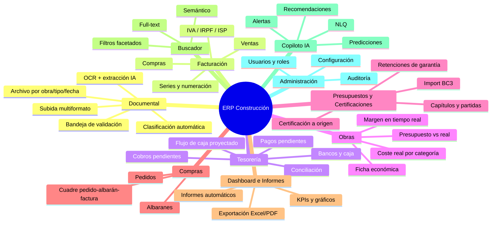

# 03 · Módulos Funcionales

Cada módulo es un bounded context con sus propias pantallas, endpoints y reglas. La obra (`project`) es la dimensión transversal que los atraviesa todos.

## Mapa de módulos

## M1 · Gestión documental (núcleo)

- **Entrada**: arrastrar y soltar (multi-archivo), foto desde móvil, buzón de email dedicado, API. Formatos: PDF, JPG, PNG, HEIC, TIFF, XML (Facturae/UBL), ZIP.
- **Pipeline**: subida → OCR/extracción IA → clasificación (tipo de documento, categoría de gasto, obra sugerida) → **bandeja de validación**.
- **Bandeja de validación**: vista de dos paneles (documento a la izquierda, campos extraídos editables a la derecha, con la zona del documento de la que procede cada dato resaltada al enfocar el campo). Validar con una tecla; los campos con confianza baja aparecen marcados.
- **Archivo**: navegación por obra / tipo / proveedor / mes; todo documento validado queda enlazado a su entidad económica (factura, albarán…).
- **Avisos del pipeline**: duplicado detectado, descuadre base+IVA≠total, NIF inválido, factura ya vencida al subirla.

## M2 · Facturación

- **Compras**: nacen casi siempre del pipeline documental. Estados: `pendiente_validacion → validada → parcial/pagada`. Reparto multi-obra y multi-categoría por líneas. Soporte de **inversión del sujeto pasivo** (habitual entre contratista y subcontratista en construcción) e IRPF.
- **Ventas**: emisión de facturas propias con series configurables (p.ej. `FV-2026-`), generación desde certificación aprobada o presupuesto, PDF con plantilla corporativa, envío por email. Preparado para **VeriFactu/Facturae**.
- **Vencimientos**: al validar una factura se generan automáticamente sus vencimientos según la forma de pago (30/60/90, confirming, pagaré…), editables.

## M3 · Tesorería

- **Cobros y pagos pendientes**: listas operativas ordenadas por vencimiento, con aging (0-30/30-60/60-90/+90), acciones de "marcar pagado", pago parcial, remesas.
- **Bancos y caja**: cuentas ilimitadas; la caja es una cuenta de tipo `caja` con movimientos manuales. Importación de extractos (CSV/Norma 43) o **sincronización automática PSD2** (GoCardless Bank Account Data u similar).
- **Conciliación**: sugerencia automática de emparejamiento movimiento↔vencimiento (importe + fecha + similitud del concepto con el proveedor); confirmación en un clic.
- **Flujo de caja**: curva de saldo real + proyección a 30/60/90 días a partir de vencimientos y estacionalidad histórica; escenarios (¿y si el cliente X paga 30 días tarde?).

## M4 · Obras (proyectos)

- **Ficha de obra**: datos de contrato, cliente, fechas, estado, retención de garantía, equipo asignado.
- **Panel económico en tiempo real**: contratado · presupuestado · coste real (desglosado por las 8 categorías) · certificado · facturado · cobrado · **margen actual (€ y %)** · desviación presupuesto vs. real por capítulo.
- **Imputación**: toda factura/línea, albarán o pedido pide obra; existe la pseudo-obra "Gastos generales" para costes de estructura.
- **Documentos de obra**: todo lo archivado filtrado por la obra (contrato, facturas, albaranes, certificaciones, fotos).

## M5 · Presupuestos y certificaciones

- **Presupuestos**: árbol de capítulos → partidas con cantidad, unidad, coste y precio; versionado; **importación BC3/FIEBDC-3** (estándar español de presupuestación) y Excel; comparativo entre versiones.
- **Certificaciones**: certificación mensual a origen por partida (cantidad o %), cálculo automático de la certificación del periodo (origen actual − origen anterior), retención de garantía, y generación de la **factura de venta** al aprobarla.
- **Control**: certificado a origen vs. facturado vs. cobrado por obra; avisos si se certifica por encima del contrato.

## M6 · Compras: pedidos y albaranes

- **Pedidos**: creación rápida (también desde el móvil a pie de obra), envío por email al proveedor con PDF, estados hasta `facturado`.
- **Albaranes**: alta por foto (el OCR extrae proveedor, fecha y líneas) o manual; recepción contra pedido (control de cantidades pendientes).
- **Cuadre a 3 bandas (3-way match)**: al validar una factura de compra, el sistema propone los albaranes/pedidos abiertos del proveedor y avisa de diferencias de precio o cantidad → evita pagar de más, principal fuga de dinero en construcción.

## M7 · Dashboard e informes

**Dashboard principal** (configurable por rol):

| Widget | Fuente |
|---|---|
| Facturación mensual (12 meses, barras) | `mv_monthly_summary` |
| Gastos mensuales por categoría (barras apiladas) | `mv_monthly_summary` |
| Beneficio mensual y acumulado (línea) | `mv_monthly_summary` |
| IVA repercutido vs. soportado + previsión del modelo 303 | `mv_monthly_summary` |
| Cobros pendientes / Pagos pendientes (tarjetas + aging) | `mv_aging` |
| Rentabilidad por obra (ranking con margen %) | `mv_project_economics` |
| Posición de tesorería + curva de caja proyectada | `mv_treasury_position` |
| Alertas activas (vencidos, liquidez, duplicados) | `alerts` |

**Informes** (todos exportables a **Excel (xlsx)** y **PDF**, con envío programado por email):

- Cierre mensual (P&L de gestión), libro de facturas emitidas/recibidas (formato compatible con asesoría/AEAT), informe económico por obra, aging de cobros/pagos, resumen de IVA por trimestre, comparativo presupuesto vs. real, diario de tesorería.

## M8 · Buscador inteligente

- Caja única global (atajo `Ctrl/Cmd+K`): busca en facturas, documentos, contactos, obras, pedidos y albaranes.
- Entiende importes, fechas y rangos ("facturas de Ferralla López de más de 5.000 € en marzo").
- Filtros facetados post-búsqueda: tipo, obra, categoría, estado, rango de fechas/importes.
- Resultados con vista previa del documento y resaltado del término encontrado.
- Detalle técnico en `02-base-de-datos.md` §4.

## M9 · Copiloto IA

- **Chat NLQ**: responde "¿Cuánto hemos gastado en materiales este mes?", "¿Qué clientes tienen facturas pendientes?", "¿Qué obra tiene peor margen?" mediante *tool use* sobre consultas tipadas y con los permisos del usuario. Las respuestas citan los datos (enlaces a facturas/obras).
- **Alertas proactivas**: pagos/cobros vencidos (diario), riesgo de liquidez (proyección < umbral), desviación de presupuesto > X% en un capítulo, subida de precio de un material respecto al histórico, posible duplicado.
- **Recomendaciones**: comparativa de precios entre proveedores del mismo material, partidas sistemáticamente desviadas, clientes con peor comportamiento de pago.
- **Informe automático mensual** redactado (resumen ejecutivo + tablas) enviado a gerencia.

## M10 · Administración

- **Usuarios y roles** con la siguiente matriz base:

| Capacidad | Admin | Gerente | Administración | Obra |
|---|:-:|:-:|:-:|:-:|
| Configuración, usuarios, backups | ✅ | — | — | — |
| Dashboard global y márgenes | ✅ | ✅ | ✅ | — |
| Validar/editar facturas, tesorería, conciliación | ✅ | ✅ | ✅ | — |
| Ver datos económicos de todas las obras | ✅ | ✅ | ✅ | — |
| Subir documentos/fotos, crear pedidos y albaranes | ✅ | ✅ | ✅ | ✅ (sus obras) |
| Ver documentación de obra | ✅ | ✅ | ✅ | ✅ (sus obras) |
| Exportar informes | ✅ | ✅ | ✅ | — |
| Copiloto IA | ✅ | ✅ | ✅ | ✅ (limitado a sus obras) |

- **Auditoría**: consulta del `audit_log` con filtros (usuario, entidad, fecha).
- **Configuración**: series de facturación, umbrales de alertas (liquidez, desviación), categorías/subcategorías, plantillas PDF, condiciones de pago por defecto, buzón de email de entrada.
